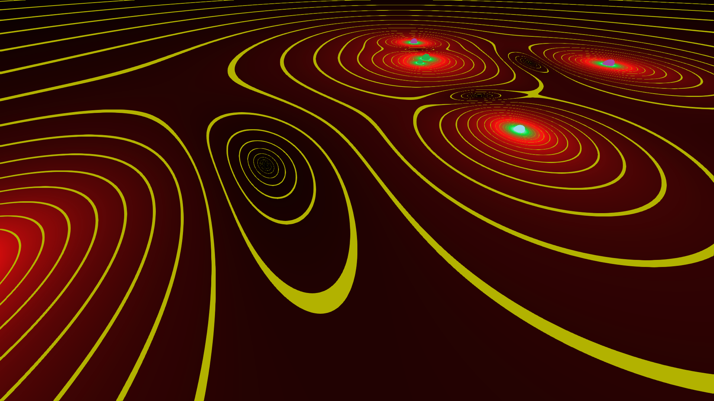

# Gravitation-Simulation

A portable 3D Newtonian-Gravity Simulator, written using my C++ graphics library ReindeerGL (which provides a useful wrapper for OpenGL 4+).
Data files which use a confusing and poorly made format I created in highschool are specified by a path as a command line argument. 
The data files initialize the scene's starting objects, positions, velocities, and masses. Then inverse squared acceleration is applied to each object at every iteration.
There is a horizontal plane which uses gradient colouring and lines of equivalent potential energy to give a graphical representation of the 
gravitational field.

## Build/Install
Run `make all`.

## Example

